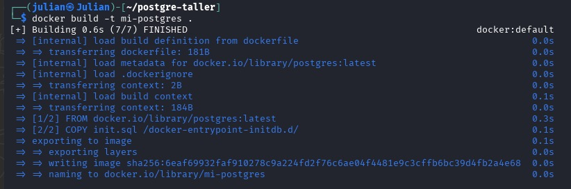

# Taller base de datos

Este proyecto muestra cómo crear una **imagen personalizada de PostgreSQL** mediante comandos docker desde linux.


## 2. Construcción de la imagen Docker

El archivo [dockerfile](./dockerfile) define la imagen de PostgreSQL. En él se establecen las variables de entorno para configurar el usuario, contraseña y base de datos por defecto.

Dentro de la carpeta del proyecto se ejecuto:

```bash
docker build -t mi_postgres .
```



## 3. Ejecucion del contenedor

Creamos el contenedor utilizando la imagen que construimos y asignadndo este al puerto **5432**

Para correr el contenedor:

```bash
docker run -d --name contenedor-postgres -p 5432:5432 mi-postgres 
```
 
Probamos que la imagen esta corriendo correctamente con docker ps:


